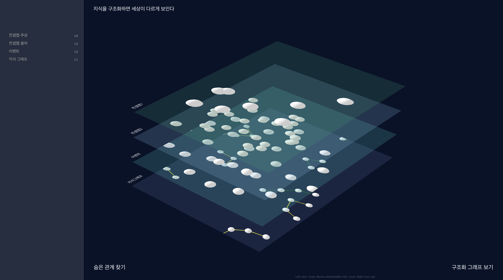
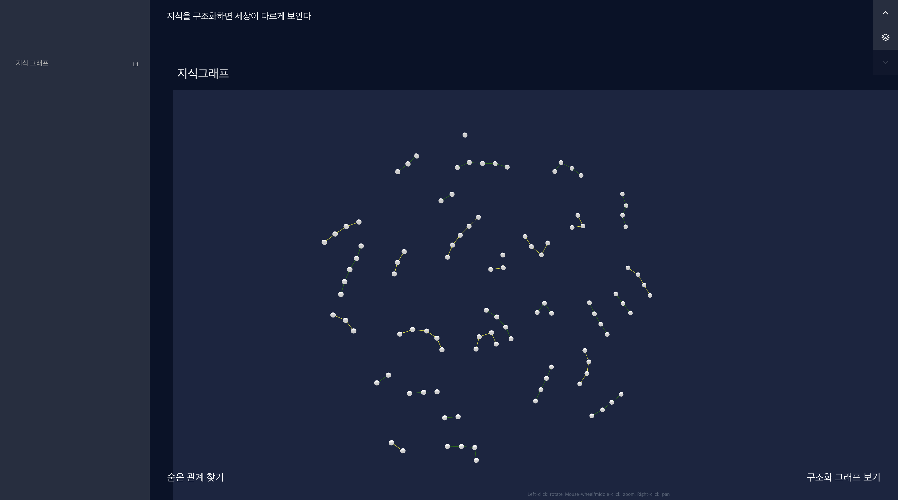
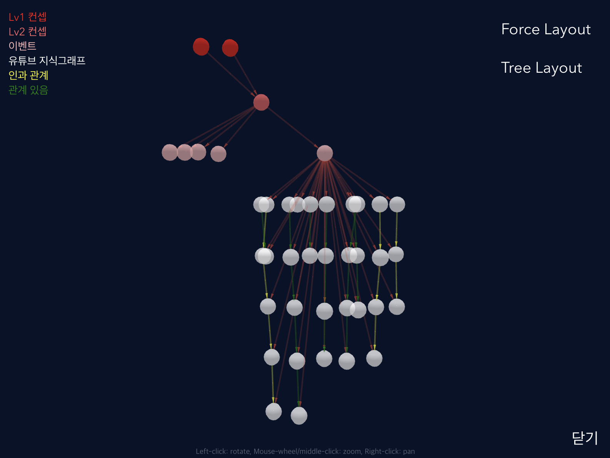
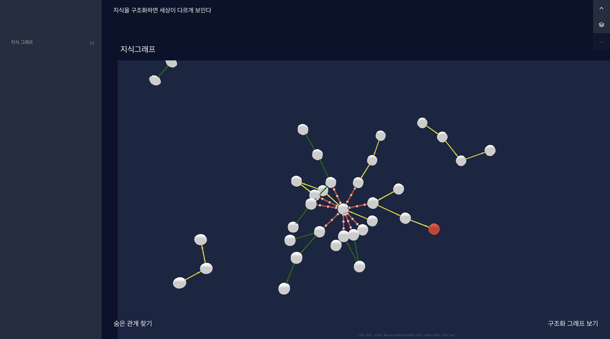

# 지능정보 SW 6기 자연어처리 8조 - 지구다

<table>
 <tr>
    <td align="center"><a href="https://github.com/eunhyea"></td>
    <td align="center"><a href="https://github.com/eunwookim"></td>
    <td align="center"><a href="https://github.com/Auspiland"></td>
    <td align="center"><a href="https://github.com/DoxB"></td>
  </tr>
  <tr>
    <td align="center"><a href="https://github.com/eunhyea"><b>고은혜</b></td>
    <td align="center"><a href="https://github.com/eunwookim"><b>김은우</b></td>
    <td align="center"><a href="https://github.com/Auspiland"><b>윤정한</b></td>
    <td align="center"><a href="https://github.com/DoxB"><b>임정규</b></td>
  </tr>
  <tr>
    <td align="center">Python</td>
    <td align="center">Python</td>
    <td align="center">Python</td>
    <td align="center">Python</td>
  </tr>
</table>

 
 

# 지구다 WEB

## 유튜브 기반 내용을 **구조화**하여 **시각화**하는 서비스

### 1. 메인화면

### 2. 레이어

### 3. 구조화

### 4. 숨은 관계 탐지
